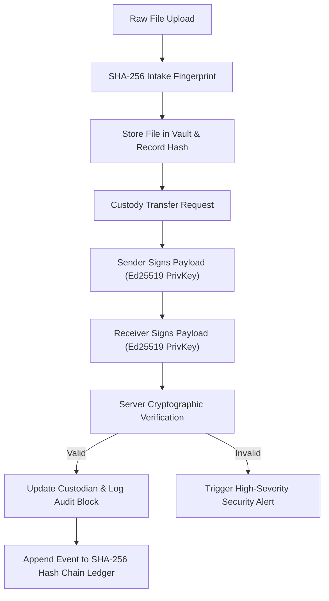

# ZeroTrust Forensics — Comprehensive Architecture, Novelty vs. Blockchain & Deployment Guide

> **Digital Forensics Case Management System**
> *Engineered with Cryptographic Chain of Custody, SHA-256 Evidence Fingerprinting, Ed25519 Dual Signatures, and Hash-Linked Audit Ledgers.*

---

## 📋 Table of Contents
1. [Executive Summary & Problem Statement](#1-executive-summary--problem-statement)
2. [Novelty Analysis: ZeroTrust Forensics vs. Blockchain](#2-novelty-analysis-zerotrust-forensics-vs-blockchain)
3. [Proposed ZeroTrust Solution & High-Level Architecture](#3-proposed-zerotrust-solution--high-level-architecture)
4. [Internal Deep Dive into Application Modules](#4-internal-deep-dive-into-application-modules)
   - [4.1 Authentication & Server-Enforced RBAC](#41-authentication--server-enforced-rbac)
   - [4.2 Forensic Case Management Directory](#42-forensic-case-management-directory)
   - [4.3 Digital Evidence Vault & SHA-256 Checksums](#43-digital-evidence-vault--sha-256-checksums)
   - [4.4 Chain of Custody & Ed25519 Dual Signatures](#44-chain-of-custody--ed25519-dual-signatures)
   - [4.5 Append-Only Hash-Linked Audit Ledger](#45-append-only-hash-linked-audit-ledger)
   - [4.6 Security Alerts & Anomaly Center](#46-security-alerts--anomaly-center)
5. [Step-by-Step AWS Cloud Deployment Guide](#5-step-by-step-aws-cloud-deployment-guide)

---

## 1. Executive Summary & Problem Statement

### The Problem
During digital forensics investigations (cybercrime, corporate insider exfiltration, malware analysis), handling digital evidence (memory dumps, disk images, log files, network packet captures) presents critical vulnerabilities:

1. **Undetected File Alteration**: A stored evidence file can be modified on disk (intentionally or accidentally). Without continuous cryptographic fingerprinting, changes go unnoticed, destroying evidentiary value in legal or compliance proceedings.
2. **Weak Custody Accountability**: Traditional case management systems record custody transfers as simple database updates or typed names. A list of names in a database does not prove who actually authorized or received the evidence.
3. **Editable Log Histories**: Standard database event logs can be modified, deleted, or forged by privileged database administrators or attackers.
4. **Superficial Role Controls**: Hiding UI buttons does not prevent malicious API requests if backend endpoints fail to strictly enforce server-side Role-Based Access Control (RBAC).

---

## 2. Novelty Analysis: ZeroTrust Forensics vs. Blockchain

When presenting this project to academic mentors, evaluators, or CISOs, a common question arises:  
**"Why not simply use a Blockchain (e.g. Ethereum or Hyperledger) for forensic chain of custody?"**

Here is the technical comparison highlighting the **novelty**, **performance advantages**, and **forensic engineering superiority** of our ZeroTrust Forensics architecture over traditional Blockchain implementations:

### Comparative Matrix

| Feature / Dimension | Standard Blockchain (Ethereum / Hyperledger) | ZeroTrust Forensics Architecture | Technical & Novelty Advantage |
| :--- | :--- | :--- | :--- |
| **Evidence File Storage** | Cannot store multi-gigabyte raw files (RAM dumps, E01 disk images) on-chain due to block size limits. Requires complex off-chain storage (IPFS/S3). | **Integrated Vault & Native SHA-256 Byte Fingerprinting**: Stores physical evidence files locally/EBS with direct byte-level SHA-256 digest computation. | Direct forensic file intake without multi-cloud off-chain storage latency or external API failure points. |
| **Custody Transfer Approval** | Unilateral push transfer (Sender pushes token to address without recipient cryptographic consent). | **Dual-Party Asymmetric Ed25519 Verification**: Both Sender AND Intended Receiver MUST sign the payload with independent keypairs. | Enforces strict legal chain-of-custody rules where unaccepted transfers are rejected and audited. |
| **Tamper Detection Scope** | Guarantees transaction history immutability, but **cannot detect if a stored physical file on local disk was edited**. | **Bi-directional Tamper Detection**: Verifies both **Physical File Bytes** (SHA-256) AND **Ledger Chain Links** ($H_N = \text{SHA-256}(\dots \parallel H_{N-1})$). | Detects unauthorized disk-level byte modifications immediately via active security alerts. |
| **Confidentiality & Privacy** | Public ledgers expose metadata; private blockchains require complex Zero-Knowledge Proof (ZKP) circuits. | **AES-256-GCM Metadata Encryption**: Encrypts sensitive suspect notes & informant tags using 256-bit GCM keys with authenticated tags. | RBAC-restricted metadata decryption with audit logging, complying with forensic privacy standards. |
| **Latency & Cost** | High latency (seconds to minutes block confirmation) and gas fees or node cluster maintenance. | **Micro-second Hash-Linked Audit Chain**: Instant SHA-256 recalculation, 0 gas fees, lightweight deployment. | High-speed laboratory operations with zero financial overhead and instant verification. |
| **Demonstrability & Testing** | Difficult to simulate attack vectors live without altering blockchain state or resetting nodes. | **Built-in Tamper & Anomaly Simulator**: Includes interactive tools to simulate file byte edits & DB tampering live. | Proves integrity verification and security alert detection live in front of evaluators. |

---

### Key Novelty Points for Mentors

1. **Dual-Party Cryptographic Signatures (Ed25519)**:
   Unlike blockchain transfers where a sender unilaterally pushes an asset, ZeroTrust Forensics holds transfer requests in `PENDING_RECEIVER_SIGNATURE`. Custody changes **only** after both Sender and Receiver supply valid Ed25519 signatures verified via server-side public key cryptography (`crypto.verify`).

2. **Bi-directional Integrity (File-Level + Ledger-Level)**:
   A blockchain only proves that a hash string was logged at a certain time. It does **not** verify whether a 20GB forensic image on a laboratory hard drive was altered by a rogue analyst. Our system performs live file byte re-verification against stored original digests.

3. **Zero-Trust Verification Without Heavy Infrastructure**:
   Delivers the cryptographic proof of a hash-linked chain without requiring expensive P2P node networks, mining, or complex smart contract deployments.

---

## 3. Proposed ZeroTrust Solution & High-Level Architecture



---

## 4. Internal Deep Dive into Application Modules

### 4.1 Authentication & Server-Enforced RBAC
- **Password Protection**: Passwords are hashed using Node.js `scrypt` with a 16-byte random salt and verified using `crypto.timingSafeEqual`.
- **Role Permission Matrix**:
  - **Admin**: User directory management, system configuration, global audit review, alert resolution.
  - **Investigator**: Case creation, evidence upload, custody transfer initiation, metadata decryption.
  - **Lab Analyst**: View assigned evidence, run hash re-verification, sign custody transfer acceptances.
  - **Auditor**: Read-only access, run ledger chain verification, resolve security alerts.

### 4.2 Forensic Case Management Directory
- Organizes investigation dockets with classification levels (`SECRET`, `CONFIDENTIAL`, `RESTRICTED`, `UNCLASSIFIED`).
- Links associated evidence artifacts, lead investigator details, and audit history.

### 4.3 Digital Evidence Vault & SHA-256 Checksums
- Reads raw intake file bytes and computes a 256-bit SHA-256 digest:
  $$\text{SHA-256}(B) = H$$
- **Re-Verification**: Reads physical file bytes from disk on demand, recalculates current digest, and compares with original stored digest. If a mismatch is detected, it sets status to `TAMPERED` and triggers an automated `CRITICAL` Security Alert.
- **AES-256-GCM Metadata Encryption**: Confidential notes are encrypted with 256-bit GCM keys, random 96-bit IVs, and authentication tags.

### 4.4 Chain of Custody & Ed25519 Dual Signatures
- Every user receives a unique Ed25519 public/private keypair at registration.
- **Transfer Protocol**:
  1. $\text{payload} = \text{EvidenceID} \parallel \text{SenderID} \parallel \text{ReceiverID} \parallel \text{Timestamp} \parallel \text{Reason}$
  2. Sender signs payload with Sender's Ed25519 Private Key.
  3. Receiver signs payload with Receiver's Ed25519 Private Key.
  4. Server verifies BOTH signatures against registered Public Keys using `crypto.verify`. Only if both signatures match is custody updated.

### 4.5 Append-Only Hash-Linked Audit Ledger
- Each event is recorded into `audit_ledger` with sequence number $N$.
- Block Hash Formula:
  $$\text{Current\_Hash}_N = \text{SHA-256}(N \parallel \text{Timestamp} \parallel \text{ActorID} \parallel \text{Action} \parallel \text{ResourceID} \parallel \text{Details} \parallel \text{Current\_Hash}_{N-1})$$
- **Ledger Verification**: Recalculates the chain from genesis ($N=1$) to current head to detect database tampering.

### 4.6 Security Alerts & Anomaly Center
- Automatically logs security alerts for file tampering, invalid digital signatures, and audit chain breaks.

---

## 5. Step-by-Step AWS Cloud Deployment Guide

### Recommended AWS Architecture
- **Compute**: AWS EC2 instance (Ubuntu 24.04 LTS, `t3.small` or `t3.medium`).
- **Process Manager**: PM2 (Daemon process runner with auto-restart on system reboot).
- **Reverse Proxy**: Nginx with TLS/SSL encryption (Let's Encrypt / Certbot).
- **Storage**: AWS EBS Elastic Block Store volume for local SQLite database & `./uploads` directory.

---

### Step 1: Provision AWS EC2 Instance

1. Log into **AWS Management Console** and open **EC2**.
2. Click **Launch Instance**:
   - **Name**: `ZeroTrust-Forensics-Server`
   - **AMI**: Ubuntu Server 24.04 LTS (64-bit x86)
   - **Instance Type**: `t3.small` (2 vCPU, 2 GB RAM)
   - **Key Pair**: Create or select an SSH key pair (`zerotrust-key.pem`).
3. **Inbound Security Group Rules**:
   - **SSH (Port 22)**: Your IP
   - **HTTP (Port 80)**: Anywhere (`0.0.0.0/0`)
   - **HTTPS (Port 443)**: Anywhere (`0.0.0.0/0`)

---

### Step 2: Connect to EC2 & Install Node.js Environment

Connect via SSH:
```bash
chmod 400 zerotrust-key.pem
ssh -i "zerotrust-key.pem" ubuntu@<YOUR-EC2-PUBLIC-IP>
```

Install Node.js 20 LTS, Git, and Nginx:
```bash
sudo apt update && sudo apt upgrade -y
curl -fsSL https://deb.nodesource.com/setup_20.x | sudo -E bash -
sudo apt install -y nodejs git build-essential nginx
```

---

### Step 3: Clone Repository & Build Application

Clone repository and configure production environment:
```bash
git clone https://github.com/Hema-1706/zerotrust-forensics.git
cd zerotrust-forensics

cat << 'EOF' > .env
PORT=3001
NODE_ENV=production
DATABASE_PATH=./data/zerotrust_forensics.db
UPLOAD_DIR=./uploads
JWT_SECRET=production-secret-key-32-bytes-zerotrust
AES_METADATA_MASTER_KEY=4a8f9c1e2b3d4e5f6a7b8c9d0e1f2a3b4c5d6e7f8a9b0c1d2e3f4a5b6c7d8e9f
EOF

npm install
npm test
npm run build
```

---

### Step 4: Configure PM2 Process Manager

Run application 24/7 as a background daemon:
```bash
sudo npm install -g pm2
pm2 start npm --name "zerotrust-forensics" -- run start -- -p 3001
pm2 save
pm2 startup
```
*(Copy and execute the output line generated by `pm2 startup`).*

---

### Step 5: Configure Nginx Reverse Proxy & HTTPS

Create Nginx site configuration:
```bash
sudo nano /etc/nginx/sites-available/zerotrust
```

Paste configuration:
```nginx
server {
    listen 80;
    server_name yourdomain.com <YOUR-EC2-PUBLIC-IP>;

    client_max_body_size 100M;

    location / {
        proxy_pass http://127.0.0.1:3001;
        proxy_http_version 1.1;
        proxy_set_header Upgrade $http_upgrade;
        proxy_set_header Connection 'upgrade';
        proxy_set_header Host $host;
        proxy_cache_bypass $http_upgrade;
        proxy_set_header X-Real-IP $remote_addr;
        proxy_set_header X-Forwarded-For $proxy_add_x_forwarded_for;
        proxy_set_header X-Forwarded-Proto $scheme;
    }
}
```

Enable site configuration:
```bash
sudo ln -s /etc/nginx/sites-available/zerotrust /etc/nginx/sites-enabled/
sudo rm -f /etc/nginx/sites-enabled/default
sudo nginx -t
sudo systemctl restart nginx
```

#### Add Free Let's Encrypt SSL/TLS Certificate:
```bash
sudo apt install -y certbot python3-certbot-nginx
sudo certbot --nginx -d yourdomain.com
```

---

### Step 6: Backup & Persistence Architecture

Set up periodic backup of SQLite database & `./uploads` directory to an AWS S3 bucket:
```bash
sudo apt install -y awscli
aws s3 sync ./data s3://your-forensics-backup-bucket/data
aws s3 sync ./uploads s3://your-forensics-backup-bucket/uploads
```
