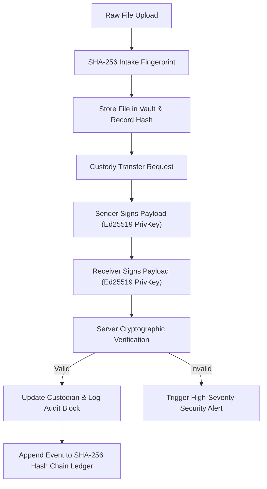

# ZeroTrust Forensics — Comprehensive Architecture & Deployment Guide

> **Digital Forensics Case Management System**
> *Engineered with Cryptographic Chain of Custody, SHA-256 Evidence Fingerprinting, Ed25519 Dual Signatures, and Hash-Linked Audit Ledgers.*

---

## 📋 Table of Contents
1. [Executive Summary & Problem Statement](#1-executive-summary--problem-statement)
2. [Proposed ZeroTrust Solution & High-Level Architecture](#2-proposed-zerotrust-solution--high-level-architecture)
3. [Internal Deep Dive into Application Modules](#3-internal-deep-dive-into-application-modules)
   - [3.1 Authentication & Server-Enforced RBAC](#31-authentication--server-enforced-rbac)
   - [3.2 Forensic Case Management Directory](#32-forensic-case-management-directory)
   - [3.3 Digital Evidence Vault & SHA-256 Checksums](#33-digital-evidence-vault--sha-256-checksums)
   - [3.4 Chain of Custody & Ed25519 Dual Signatures](#34-chain-of-custody--ed25519-dual-signatures)
   - [3.5 Append-Only Hash-Linked Audit Ledger](#35-append-only-hash-linked-audit-ledger)
   - [3.6 Security Alerts & Anomaly Center](#36-security-alerts--anomaly-center)
4. [Step-by-Step AWS Cloud Deployment Guide](#4-step-by-step-aws-cloud-deployment-guide)

---

## 1. Executive Summary & Problem Statement

### The Problem
During digital forensics investigations (cybercrime, corporate insider exfiltration, malware analysis), handling digital evidence (memory dumps, disk images, log files, network packet captures) presents critical vulnerabilities:

1. **Undetected File Alteration**: A stored evidence file can be modified on disk (intentionally or accidentally). Without continuous cryptographic fingerprinting, changes go unnoticed, destroying evidentiary value in legal or compliance proceedings.
2. **Weak Custody Accountability**: Traditional case management systems record custody transfers as simple database updates or typed names. A list of names in a database does not prove who actually authorized or received the evidence.
3. **Editable Log Histories**: Standard database event logs can be modified, deleted, or forged by privileged database administrators or attackers.
4. **Superficial Role Controls**: Hiding UI buttons does not prevent malicious API requests if backend endpoints fail to strictly enforce server-side Role-Based Access Control (RBAC).

---

## 2. Proposed ZeroTrust Solution & High-Level Architecture

### The Solution: ZeroTrust Forensics
ZeroTrust Forensics replaces implicit trust with continuous cryptographic verification across the entire lifecycle of digital evidence.



---

## 3. Internal Deep Dive into Application Modules

### 3.1 Authentication & Server-Enforced RBAC
- **Password Protection**: Passwords are hashed using Node.js `scrypt` with a 16-byte random salt and verified using `crypto.timingSafeEqual`.
- **Role Permission Matrix**:
  - **Admin**: Full administrative privileges (User management, system configuration, global audit review, alert resolution).
  - **Investigator**: Case creation, evidence upload, custody transfer initiation, metadata decryption.
  - **Lab Analyst**: View assigned evidence, run hash re-verification, sign custody transfer acceptances.
  - **Auditor**: Read-only access, run ledger chain verification, resolve security alerts.

### 3.2 Forensic Case Management Directory
- Organizes investigation dockets with classification levels (`SECRET`, `CONFIDENTIAL`, `RESTRICTED`, `UNCLASSIFIED`).
- Links associated evidence artifacts, lead investigator details, and audit history.

### 3.3 Digital Evidence Vault & SHA-256 Checksums
- Reads raw intake file bytes and computes a 256-bit SHA-256 digest:
  $$\text{SHA-256}(B) = H$$
- **Re-Verification**: Reads physical file bytes from disk on demand, recalculates current digest, and compares with original stored digest. If mismatch is detected, sets status to `TAMPERED` and triggers an automated `CRITICAL` Security Alert.
- **AES-256-GCM Metadata Encryption**: Confidential notes encrypted with 256-bit GCM keys, random 96-bit IVs, and authentication tags.

### 3.4 Chain of Custody & Ed25519 Dual Signatures
- Every user gets a unique Ed25519 public/private keypair at registration.
- **Transfer Protocol**:
  1. `payload = EvidenceID | SenderID | ReceiverID | Timestamp | Reason`
  2. Sender signs payload with Sender's Ed25519 Private Key.
  3. Receiver signs payload with Receiver's Ed25519 Private Key.
  4. Server verifies BOTH signatures against registered Public Keys using `crypto.verify`. Only if both signatures match is custody updated.

### 3.5 Append-Only Hash-Linked Audit Ledger
- Each event is recorded into `audit_ledger` with sequence number $N$.
- Block Hash Formula:
  $$\text{Current\_Hash}_N = \text{SHA-256}(N \parallel \text{Timestamp} \parallel \text{ActorID} \parallel \text{Action} \parallel \text{ResourceID} \parallel \text{Details} \parallel \text{Current\_Hash}_{N-1})$$
- **Ledger Verification**: Recalculates the chain from genesis ($N=1$) to current head to detect database tampering.

### 3.6 Security Alerts & Anomaly Center
- Automatically logs security alerts for file tampering, invalid digital signatures, and audit chain breaks.

---

## 4. Step-by-Step AWS Cloud Deployment Guide

### Recommended AWS Architecture
- **Compute**: AWS EC2 instance (Ubuntu 24.04 LTS, `t3.small` or `t3.medium`) or AWS App Runner / ECS.
- **Process Manager**: PM2 (Daemon process runner with auto-restart on system reboot).
- **Reverse Proxy**: Nginx with TLS/SSL encryption (Let's Encrypt / Certbot).
- **Storage**: AWS EBS Elastic Block Store volume for local SQLite database & `./uploads` directory.

---

### Deployment Step 1: Provision & Configure AWS EC2 Instance

1. Log into **AWS Management Console** and navigate to **EC2**.
2. Click **Launch Instance**:
   - **Name**: `ZeroTrust-Forensics-Server`
   - **AMI**: Ubuntu Server 24.04 LTS (64-bit x86)
   - **Instance Type**: `t3.small` (2 vCPU, 2 GB RAM)
   - **Key Pair**: Create or select an existing SSH key pair (`zerotrust-key.pem`).
3. **Network & Security Group Settings**:
   Allow inbound traffic for:
   - **SSH (Port 22)**: My IP (for SSH access)
   - **HTTP (Port 80)**: Anywhere (`0.0.0.0/0`)
   - **HTTPS (Port 443)**: Anywhere (`0.0.0.0/0`)
   - **Custom TCP (Port 3001)**: Optional (for testing)

---

### Deployment Step 2: Connect to EC2 & Install Node.js Environment

Open terminal and SSH into your AWS instance:
```bash
chmod 400 zerotrust-key.pem
ssh -i "zerotrust-key.pem" ubuntu@<YOUR-EC2-PUBLIC-IP>
```

Update packages and install Node.js 20/22 LTS & Build tools:
```bash
sudo apt update && sudo apt upgrade -y
curl -fsSL https://deb.nodesource.com/setup_20.x | sudo -E bash -
sudo apt install -y nodejs git build-essential nginx
```

Verify installation:
```bash
node -v   # Should show v20.x or v22.x
npm -v    # Should show v10.x
```

---

### Deployment Step 3: Clone Repository & Build Application

Clone your GitHub repository onto the AWS EC2 instance:
```bash
git clone https://github.com/Hema-1706/zerotrust-forensics.git
cd zerotrust-forensics
```

Create production `.env` file:
```bash
cat << 'EOF' > .env
PORT=3001
NODE_ENV=production
DATABASE_PATH=./data/zerotrust_forensics.db
UPLOAD_DIR=./uploads
JWT_SECRET=production-secret-key-32-bytes-zerotrust
AES_METADATA_MASTER_KEY=4a8f9c1e2b3d4e5f6a7b8c9d0e1f2a3b4c5d6e7f8a9b0c1d2e3f4a5b6c7d8e9f
EOF
```

Install dependencies, run tests, and build production Next.js assets:
```bash
npm install
npm test
npm run build
```

---

### Deployment Step 4: Configure PM2 Process Manager

Install PM2 globally to keep the Node.js application running 24/7 and auto-restart on system reboots:
```bash
sudo npm install -g pm2
pm2 start npm --name "zerotrust-forensics" -- run start -- -p 3001
pm2 save
pm2 startup
```

*(Copy and execute the output command provided by `pm2 startup` to enable systemd auto-start).*

Verify application status:
```bash
pm2 status
curl http://localhost:3001/api/auth/me
```

---

### Deployment Step 5: Configure Nginx Reverse Proxy & SSL (HTTPS)

Create Nginx server configuration for ZeroTrust Forensics:
```bash
sudo nano /etc/nginx/sites-available/zerotrust
```

Add the following Nginx reverse proxy configuration (replace `yourdomain.com` or EC2 IP):
```nginx
server {
    listen 80;
    server_name yourdomain.com <YOUR-EC2-PUBLIC-IP>;

    client_max_body_size 100M; # Support large evidence file uploads

    location / {
        proxy_pass http://127.0.0.1:3001;
        proxy_http_version 1.1;
        proxy_set_header Upgrade $http_upgrade;
        proxy_set_header Connection 'upgrade';
        proxy_set_header Host $host;
        proxy_cache_bypass $http_upgrade;
        proxy_set_header X-Real-IP $remote_addr;
        proxy_set_header X-Forwarded-For $proxy_add_x_forwarded_for;
        proxy_set_header X-Forwarded-Proto $scheme;
    }
}
```

Enable site configuration and restart Nginx:
```bash
sudo ln -s /etc/nginx/sites-available/zerotrust /etc/nginx/sites-enabled/
sudo rm -f /etc/nginx/sites-enabled/default
sudo nginx -t
sudo systemctl restart nginx
```

#### Add Free Let's Encrypt SSL/TLS Certificate (Optional for Domains):
```bash
sudo apt install -y certbot python3-certbot-nginx
sudo certbot --nginx -d yourdomain.com
```

---

### Deployment Step 6: Backup & Persistence Architecture

1. **Database & Evidence Backup script**:
   Set up a daily cron job to back up `./data/zerotrust_forensics.db` and `./uploads` to an AWS S3 bucket:
   ```bash
   sudo apt install -y awscli
   aws s3 sync ./data s3://your-forensics-backup-bucket/data
   aws s3 sync ./uploads s3://your-forensics-backup-bucket/uploads
   ```

2. Access your AWS deployed production application live at:
   `https://yourdomain.com` or `http://<YOUR-EC2-PUBLIC-IP>`
